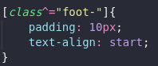
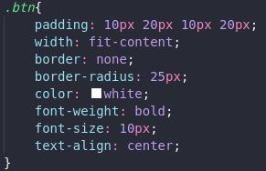
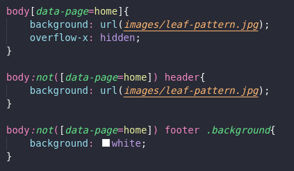

# C3 : Product

The main objective of the existence of the ForestSons website is to show all the work done by this fantastic group of volunteers and to share the benefits to not just Portugal but to all the world. Explication of the importance that the forests have and contribute to being part of this beautiful organization are some reasons why this project is alive too.
***
The ForestSons website are deployed in Netlify. [Click here](https://tiwm21-ti-g03.netlify.app/) to visit us.

## 3.1 Instalation
To download all the project, the user should navigate to the repository of ForestSons organization by pressing [here](https://github.com/tiwm2021-ti-g03/tiwm2021-ti-g03) and then a green "Code" download button will be visible on the right. Choose the Download ZIP option from the Code pull-down menu. That ZIP file will contain the entire repository content. That's the best way to download from GitHub. It's possible to download all the repository from the terminal, but the user must to have git installed on the computer. Steps:

- Open the terminal and change the current working directory to the location where you want the cloned directory.
- Type git clone in the terminal, paste this URL https://github.com/tiwm2021-ti-g03/tiwm2021-ti-g03.git and press "enter" to create your local clone.

To deploy a git project on Netlify, just follow [this video](https://www.youtube.com/watch?v=4h8B080Mv4U)

## 3.2 Application/Product help
There are some visual cues on our website that help the user navigation. One of them is on Mobile Resolution in the "Blog" page that has a cursor that indicates the user to click on the post to activate the animation and show the post description. Also, the usage of tooltips is present on the "Forests" page, which indicates the name of the fields that are represented in icons. On the "Inquiry" page, all the form inputs have placeholders to indicate what they represent. The rest of the website was designed in a simplistic way to help the user in all resolutions formats without having an obligation to put an indication.

## 3.3 Forms
Built-in form validation uses HTML5 form validation features, which is used on the inquiry page form inputs. This validation generally doesn't require much JavaScript. Built-in form validation has better performance than JavaScript, but it is not as customizable as JavaScript validation.
All with the exception of experience/skills input are required.
Every input has the respective type like the input where the user has to put his name have text, birth date have a minimum of 6 years - with type date, phone number type tel and email type email with the respective one, hours per week is of type number so the user can't type text, skills(the one that is not required) and address text too.
The inputs of phone number and emergency contact have a pattern that only nine numbers are accepted.
When the user successfully fills the inquiry correctly and presses on the big green button, will appear a message (this part it's with Javascript) and five seconds after will disappear (it was user an event listener).

## 3.4 HTML5 and CSS3 validation
All the HTML and CSS files passed the validation service of the W3C Markup Validation Service.

- [HTML validator](https://validator.w3.org/)
- [CSS validator](https://jigsaw.w3.org/css-validator/)

Printscreens of those moments below

HTML PAGES

Homepage:

Inquiry page:

Our Work page:

Gallery page:

Forests page:

Blog page:

All the HTML pages have the exact same two warnings because like it's saying on the printscreens "Section lacks heading" or "Article lacks heading".

CSS PAGE (styles.css)

CSS with no errors or warnings.

## 3.5 Implementation details
This section will show some printscreens of the code that ForestSons Website have to complete all the rules.
4 HTML static pages ( in this case 6 )

XML files and respective schemas for validation

XML for forests page

XSD for forests page

XML for blog page

XSD for blog page

Use of header-main-section tags

Footer and Article

Table (incremented with javascript)

External Links (to maps incremented with javascript)

Links to other pages

Form in inquiry page

Use of lists

Types of selectors 

Pseudo-elements and combiner selectors

Font and text properties

Background format

List format

HTML box elements

Float and padding

Hide Element

Table Format

Substitution of element by image

Medias

Those printscreens only show 5% of our code to show that ForestSons Website had followed the rules.

---
[< Previous](c2.md) | [^ Main](../../..) | [Next >](c4.md)
:--- | :---: | ---: